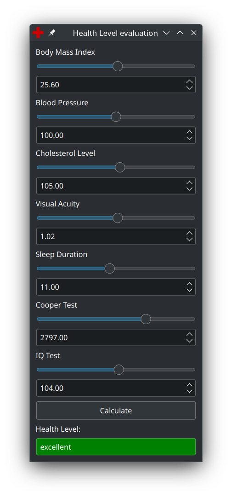

# Проектування інтелектуальних інтерфейсів
## Лабораторна робота №02

Тема: Інтелектуальний інтерфейс на основі обчислень зі словами для діагностики здоров'я людини

Виконав: Волошин Віталій Анатолійович, ІПЗм-21

Презентація: [task_02.pptx](task_02.pptx)  

Тестові дані: [data.csv](data.csv)

